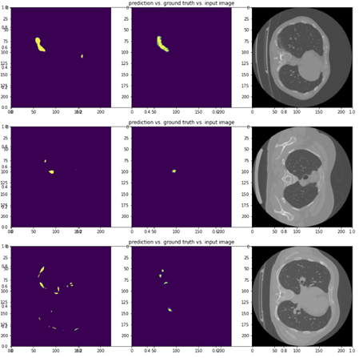
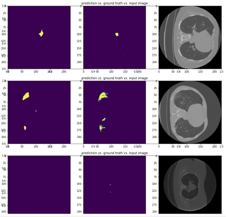

# COVID-19 Diagnosis Tool

A COVID-19 Diagnosis Tool for identifying COVID-19 positive patients based on lung CT scans, and determine the area of infections on patient's lung CT scans.


## Dataset

The raw data are in .nii format with masks. The .nii files are converted to .png files using the MATLAB Script under data_preprocessing. The description of the raw data used can also be found inside the same folder.

## Models

### Classification Model

A pre-trained ResNet18 + 3-layer Fully-connected layers ANN is used for testing whether the given CT scan belongs to a COVID-19 positive patient. The test accuracy is 92%.

### Segmentation Model

A U-net is used for labelling the area of infections on the CT scans. 


## Training

Setup the environment and install the dependencies required:

``` python
python setup.py
```

### Baseline Model

``` python
python baseline.py
```

### Model

``` python
python train.py
```

## Some Segmentation Examples

Left: Model Prediction

Middle: Ground Truth

Right: Original CT Scan




